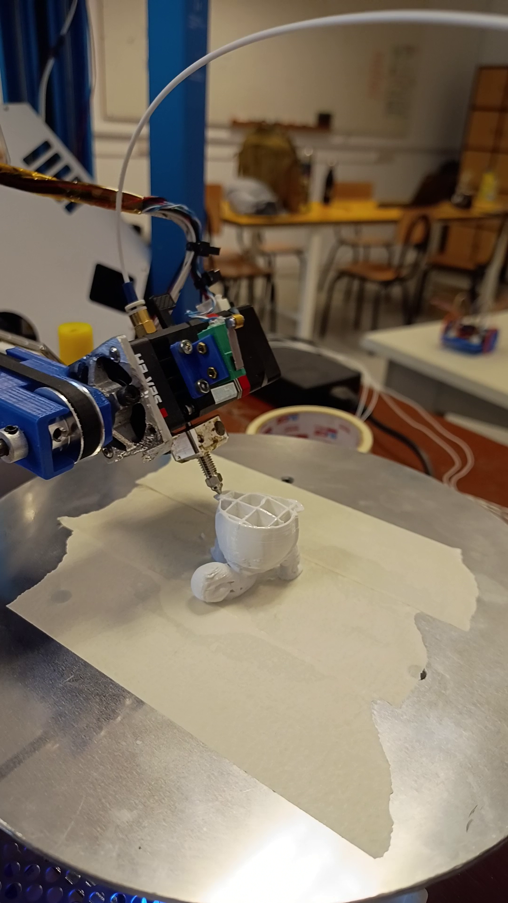

# Hi! I'm Emmanuel

I have a Master's in Computer Science, and I know way too much about how GPS/GNSS works. I'm a developer in multiple FOSS projects, worked at agrotech, and I currently work on small robotics projects. Spanish is my native language, I am fluent in English and I am studying Chinese.

## What I do

- General coding (click to see my work on that language): [Java](https://github.com/EmmanuelMess?tab=repositories&q=&type=&language=java&sort=), [Kotlin](https://github.com/EmmanuelMess?tab=repositories&q=&type=&language=kotlin&sort=stargazers), [C](https://github.com/EmmanuelMess?tab=repositories&q=&type=&language=c&sort=stargazers), [C++](https://github.com/EmmanuelMess?tab=repositories&q=&type=&language=c%2B%2B&sort=stargazers), [Python](https://github.com/EmmanuelMess?tab=repositories&q=&type=&language=python&sort=stargazers), and some [CUDA C++](https://github.com/EmmanuelMess?tab=repositories&q=&type=&language=cuda&sort=stargazers) and [OpenCL C](https://github.com/EmmanuelMess?tab=repositories&q=opencl&type=&sort=stargazers). Also, for school, I have coded in [Haskell](https://github.com/EmmanuelMess?tab=repositories&q=&type=&language=haskell&sort=stargazers), [Erlang](https://github.com/EmmanuelMess?tab=repositories&q=&type=&language=erlang&sort=stargazers), and Standard ML.
- Embedded devices: [Arduinos](https://github.com/EmmanuelMess?tab=repositories&q=Arduino&type=source&language=&sort=stargazers), NVIDIA embedded devices (TX2, Orin, etc.), and took classes on simple electronic systems
- Machine learning: See my [Kaggle account](https://www.kaggle.com/emmanuelmess), and I also have experience working on AI for agrotech, running detection in real-time on specialized embedded devices (AI on the edge, with CUDA and TensorRT), to do realtime detection of undergrowth in crops. I've worked with Caffe, TensorFlow and PyTorch.
- Robotics: I work with [ROS](https://www.ros.org/) and [ROS 2](https://github.com/ros2) both with C++ and Python, along with learning how the [Gazebo](https://github.com/EmmanuelMess?tab=repositories&q=gazebo&type=&language=&sort=stargazers) simulator works. I know how SLAM works and, make contributions to the many repos that compose ROS and Gazebo, and many other smaller ones.
- Satellites: I know how GPS (and GNSS) works from modelling the satellite orbit to how the receiver clock is corrected, and I made two GNSS simulators: [one in python](https://github.com/EmmanuelMess/GNSS-Simulator) and one as a gazebo plugin (private for now).
- 3D printing: A mechanical engineer and I made a 4 axis 3d printer, called [Core R-Theta 4 Axis Printer](https://github.com/EmmanuelMess/Core-R-Theta-4-Axis-Printer-UNR-Improvements) (image), along with a UI for its software called [NonPlanarSlicingDeformation](https://github.com/EmmanuelMess/NonPlanarSlicingDeformation), and an adaptation to be able to run the 12860 screen with a 4th axis [Core R-Theta Menu System](https://github.com/EmmanuelMess/CoreRThetaMenuSystem).
- Android: I have a lot of expirience with Android, [here](https://github.com/EmmanuelMess?tab=repositories&q=Android&type=&language=&sort=) are my Android repos. I have also worked with Flutter and Xamarin for Android. I know how to interface C/C++ with Android using the JNI and NDK. I still contribute to the [Amaze File Manager](https://github.com/TeamAmaze/AmazeFileManager) app.
- And other tools: [MATLAB](https://github.com/EmmanuelMess?tab=repositories&q=&type=&language=matlab&sort=stargazers), Scilab and other similar math environments.
- Game development: not my forte, but I like to [make games sometimes](https://github.com/EmmanuelMess?tab=repositories&q=Game&type=&language=&sort=), I have worked with Unity, Godot, LibGdx (in Java or Kotlin), Ogre (in C++), and Raylib (in C, Python and Rust). 

I use Ubuntu in my everyday life.

## Contact
Use my mail.

----

